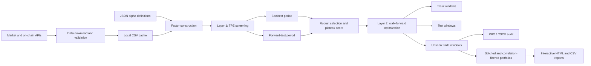

# Alphora Quant Research Lab

A research-grade cryptocurrency alpha pipeline for parameter optimization, walk-forward validation, overfitting analysis, correlation-aware portfolio construction, and interactive performance reporting.

> This repository is a portfolio project demonstrating quantitative-research engineering. It does not provide investment advice, and historical backtests do not guarantee future performance.

## Overview

Alphora Quant Research Lab converts market and on-chain datasets into reproducible strategy experiments. Alpha definitions are loaded from JSON, transformed into model signals, evaluated with transaction costs, optimized using Optuna's Tree-structured Parzen Estimator (TPE), and challenged with out-of-sample and walk-forward tests before portfolio construction.

The project emphasizes research discipline rather than a single headline backtest: time-separated datasets, parameter-stability scoring, minimum trade-activity filters, walk-forward selection, probability-of-backtest-overfitting analysis, and correlation controls.

## Research pipeline



## Key features

- JSON-driven alpha definitions supporting multiple data sources, formulas, models, trading sides, and entry/exit rules.
- Hourly CryptoQuant, Glassnode, and exchange-price data ingestion with local caching and missing-data checks.
- Shared transformation, statistical-model, and entry/exit libraries.
- Backtest, forward-test, validation-test, and full-period metric calculation.
- Optuna TPE optimization over rolling window and two decision thresholds.
- Sharpe, Sortino, or Calmar optimization objectives.
- Parameter-neighborhood scoring to prefer stable plateaus over isolated peaks.
- Rolling train/test/trade walk-forward evaluation with optional partial final windows.
- Latest-year robustness gates and configurable Sharpe, drawdown, trade-frequency, and pass-rate filters.
- Probability of Backtest Overfitting (PBO) analysis using combinatorially symmetric cross-validation.
- Stitched out-of-sample portfolio reconstruction without overlapping-window double counting.
- Correlation filtering and equal-weight portfolio analysis.
- Interactive Plotly dashboards plus CSV metadata, equity curves, yearly metrics, and error diagnostics.

## Repository structure

| Path | Purpose |
| --- | --- |
| `config.py` | Central paths, periods, optimization ranges, filters, and walk-forward settings. |
| `alpha.json` | Primary JSON alpha-definition input. |
| `get_cybo_data.py` | Downloads only the configured factor endpoints. |
| `get_cybo_full_data.py` | Downloads factor and price datasets in one workflow. |
| `get_price_data.py` | Downloads chunked exchange candle history. |
| `read_json_backtesting.py` | Runs parameterized alpha backtests. |
| `read_json_tpe_permutation.py` | Layer-1 TPE optimization and BT/FT screening. |
| `read_json_tpe_walk_forward.py` | Layer-2 rolling walk-forward optimization. |
| `runall.py` | Batch preflight and two-layer alpha screening orchestrator. |
| `read_json_pbo.py` | PBO/CSCV robustness audit. |
| `read_json_html.py` | Detailed single-alpha HTML reporting. |
| `read_wfa_stich_alpha_portfolio_html.py` | Stitches selected walk-forward trade windows into portfolio reports. |
| `read_wfa_correlation_portfolio_html.py` | Builds correlation-filtered portfolio reports. |
| `lib/` | Transformations, models, entry/exit logic, data processing, and selection scoring. |
| `tests/` | Unit tests for scoring and walk-forward robustness rules. |

Downloaded datasets and generated optimization/report folders are intentionally excluded from Git.

## Methodology

### Layer 1 — parameter screening

For each alpha, TPE searches the rolling window and two decision thresholds. Candidates are evaluated across separated backtest and forward-test periods. Filters reject configurations with weak risk-adjusted returns, excessive drawdown, insufficient trades, or unstable out-of-sample behavior.

### Layer 2 — walk-forward validation

Each round optimizes on its training interval, verifies the candidate on the following test interval, and records performance on a later unseen trade interval. Only the stitched trade windows represent the walk-forward portfolio simulation.

### Robust selection

Selection combines risk-adjusted return, drawdown, trade activity, BT-to-FT consistency, and local parameter-neighborhood quality. Validation-period metrics are reported separately and are not used by the BT/FT selection score.

### Portfolio analysis

Selected alpha trade windows can be reconstructed as an equal-weight portfolio. A separate workflow filters highly correlated candidates before calculating portfolio Sharpe ratio, drawdown, annualized return, turnover, yearly performance, and component contribution.

## Installation

Python 3.12 is recommended.

```powershell
conda create -n alphora python=3.12 -y
conda activate alphora
python -m pip install -r requirements.txt
```

If `conda` is not initialized in PowerShell:

```powershell
& "$env:USERPROFILE\miniconda3\Scripts\conda.exe" run -n alphora python -m pip install -r requirements.txt
```

## Configuration

Copy the environment template when API downloads are required:

```powershell
Copy-Item .env.example .env
```

Set `CYBOTRADE_API_KEY` in `.env`. Never commit this file.

Review `config.py` before a run. Important groups include:

- local data and output paths;
- BT, FT, VT, and full-period dates;
- TPE trial count and window range;
- model, logic, and side search options;
- Sharpe, drawdown, trade-frequency, and parameter-plateau filters;
- walk-forward train/test/trade lengths and step size;
- PBO trial and block settings;
- correlation thresholds and report destinations.

`config.py` currently uses an explicit Windows project path. Update `BASE_DIR` to the absolute location of your clone before running the workflows.

## Usage

### Validate input availability

```powershell
python runall.py alpha.json --preflight-only
```

### Download configured datasets

```powershell
python get_cybo_data.py
python get_price_data.py
```

### Run Layer 1 TPE screening

```powershell
python read_json_tpe_permutation.py
```

### Run walk-forward optimization

```powershell
python read_json_tpe_walk_forward.py
```

### Run the complete batch pipeline

```powershell
python runall.py alpha.json --l2 enable --optimize-by sortino
```

Available optimization objectives are `sharpe`, `sortino`, and `calmar`.

### Run the PBO audit

```powershell
python read_json_pbo.py
```

### Build stitched walk-forward reports

```powershell
python read_wfa_stich_alpha_portfolio_html.py --input-dir <walk-forward-output> --window all
```

### Build a correlation-filtered portfolio

```powershell
python read_wfa_correlation_portfolio_html.py --input-dir <walk-forward-output> --threshold 0.65
```

## Testing

```powershell
python -m unittest discover -s tests -v
```

The tests cover robust selection behavior, validation-data isolation, and latest-year walk-forward gates.

## Interpretation notes

- `BT` is the initial backtest period.
- `FT` is the forward-test period used for robustness screening.
- `VT` is held-out validation reporting and is excluded from BT/FT selection scoring.
- Walk-forward `trade` windows are the unseen intervals used for stitched portfolio evaluation.
- `TPI` measures trading activity and helps reject statistically weak low-trade candidates.
- Parameter plateau scores favor neighborhoods that remain useful under nearby settings.

## Disclaimer

Backtests are sensitive to data quality, revisions, fees, slippage assumptions, multiple testing, and regime changes. Review data provenance, eliminate look-ahead bias, reserve truly unseen evaluation periods, and validate all strategies independently before using them in any execution system.
